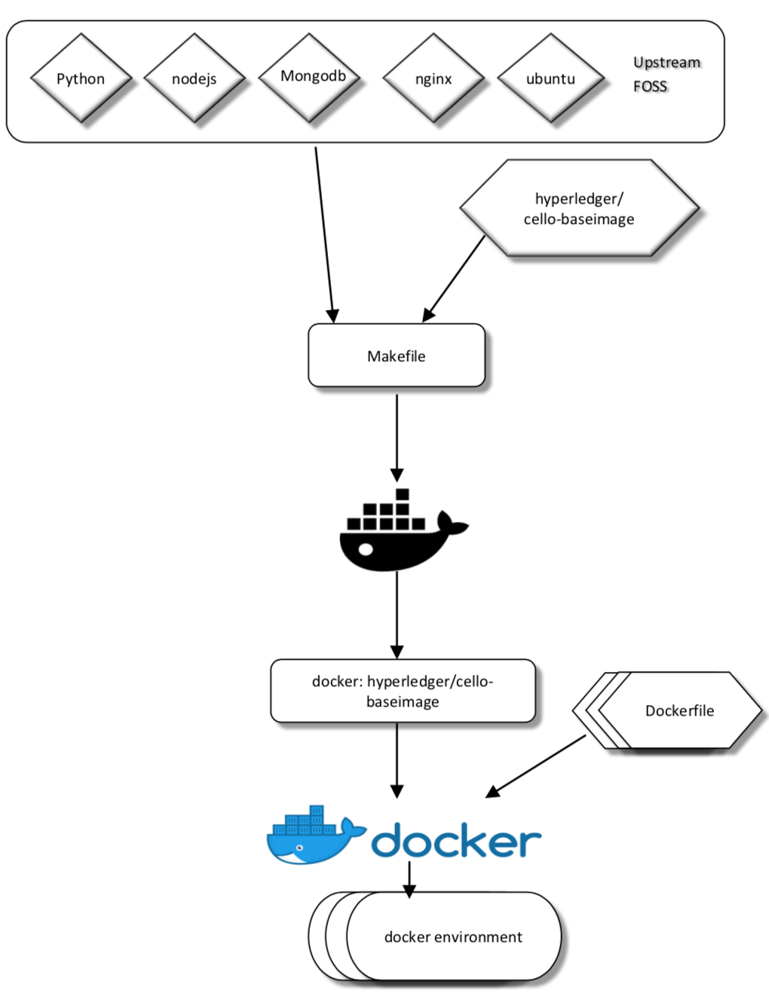
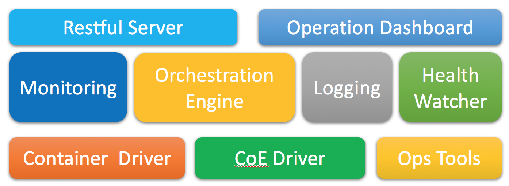

# Architecture Design

Here we discuss the architecture design for the mangement services on the Master node.

## Philosophy and principles
The architecture will follow the following principles:

* Micro-service: Means we decouple various functions to individual micro services. No service will crash others whatever it does.
* Fault-resilience: Means the service should be tolerant for fault, such as database crash.
* Scalability: Try best to distribute the services, to mitigate centralized bottle neck.

## Cello Baseimage

The purpose of this baseimage is to act as a bridge between a raw ubuntu/xenial configuration and the customizations 
required for supporting a Hyperledger Cello environment. The build process is generally expensive so it is fairly
inefficient to JIT assemble these components on demand. Hence bundled into baseimage and subsequently cached on
the public repositories, so they can be simply consumed without requiring a local build cycle.

### Usuage
* "make docker" will build the docker images and commit it to your local environment; e.g. "hyperledger/cello-baseimage".
The docker image is also tagged with architecture and release details.
* "make install" builds the docker images and push them to dockerhub.

## Functional Layers

Following the decouple design, there are 3 layers in Cello.

* Access layer: including those Web UI dashboards operated by users.
* Orchestration layer: received the request form Access layer, and make call to correct agents to operate the blockchain resources.
* Agent layer: real workers that interact with underly infrastructures like Docker, Swarm, K8s.

Each layer should maintain stable APIs for upper layers, to achieve pluggability without changing upper layer code.

### Agent layer APIs

* Host management: create, query/list, update, delete, fillup, clean, reset
* Cluster management: create, query/list, start/stop/restart, delete, reset

## Components

* `dashboard`: Provide the dashboard for the pool administrator, also the core engine to automatically maintain everything.
* `restserver`: Provide the restful api for other system to apply/release/list chains.
* `watchdog`: Timely checking system status, keep everything healthy and clean.

## Implementation

The restful related implementation is based on [Flask](flask.pocoo.org), a Werkzeug based micro-framework for web service.

The reasons of choosing it include:

* Lightweight
* Good enough in performance
* Flexible for extending
* Stable in code

 This work is licensed under a <a rel="license" href="http://creativecommons.org/licenses/by/4.0/">Creative Commons Attribution 4.0 International Licenses</a>.
