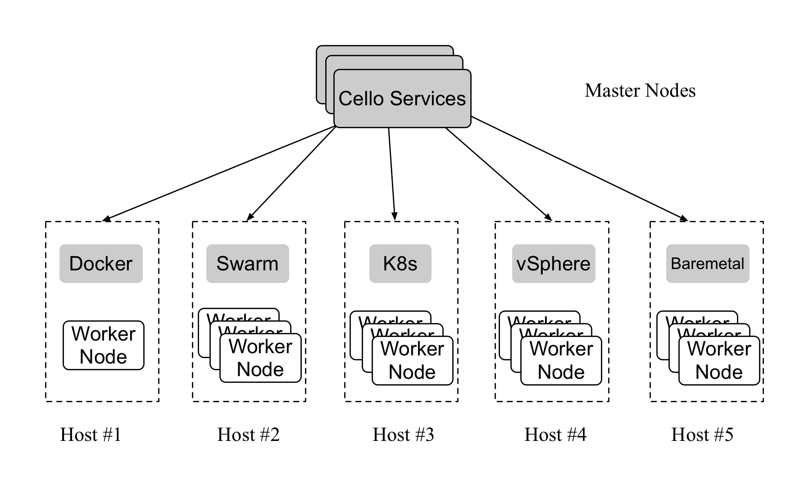

# Setup Cello

Cello follows a typical Master-Workers architecture.

* `Master`: Holds [Cello services](../service_management.md) to manage the blockchain networks inside Workers via corresponding management APIs. Typically, Master Node provides web dashboard (port `8080`) and RESTful APIs (port `80`). It is recommended to use Linux (e.g., Ubuntu 18.04) as the Master.
* `Worker`: Nodes to hold blockchain networks. Cello supports several types of `worker node` from single server to cluster. Take `Docker` or `Swarm` for example, the Worker's management APIs (i.e., Docker daemon APIs) should be accessible (typically on port `2375`) from the Master Node.

## Master Node

See [Setup Master Node](setup_master.md)

## Worker Node

Currently we support Docker Host or Swarm Cluster as Worker Node. More types will be added soon.

* `Docker Host`: [Setup Docker Host as a Worker Node](setup_worker_docker.md).
* `Docker Swarm `: [Create a Docker Swarm](https://docs.docker.com/engine/swarm/swarm-tutorial/create-swarm/).
* `vSphere`: [Setup vSphere as a Worker Node](setup_worker_vsphere.md).
* `Kubernetes`: [Setup Kubernetes as a Worker Node](setup_worker_kubernetes.md).
* `Ansible`: [Setup Ansible as a Worker Node](setup_worker_ansible.md).

## Special Configuration for Production

Here we describe the setups for development usage. If you want to deploy Cello for production, please also refer to the [Production Configuration](../production_config.md).

 This work is licensed under a <a rel="license" href="http://creativecommons.org/licenses/by/4.0/">Creative Commons Attribution 4.0 International License</a>.
