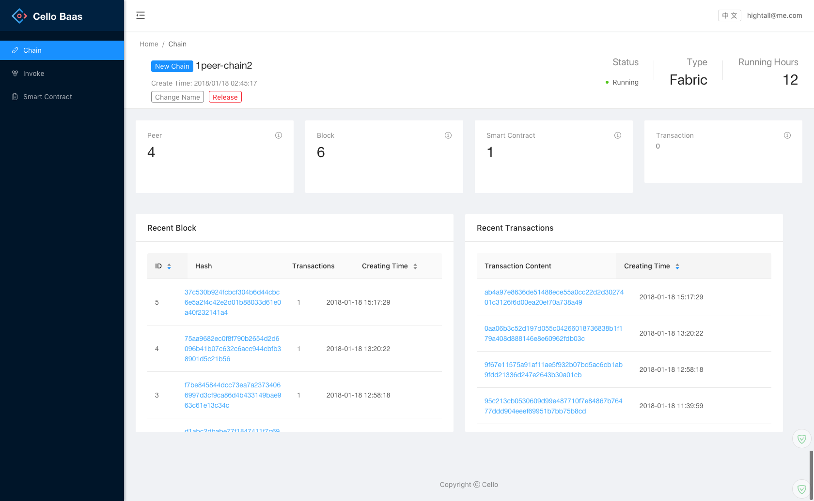
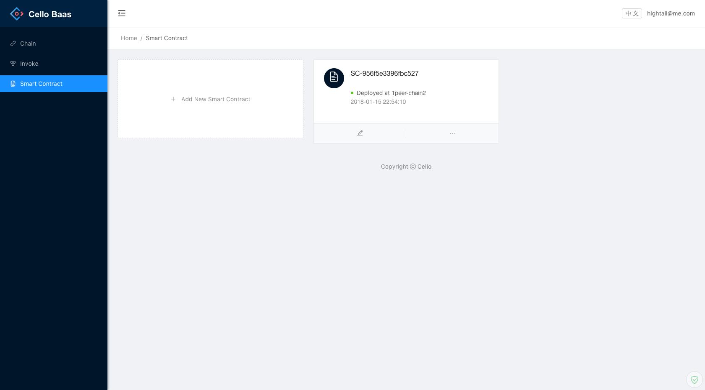
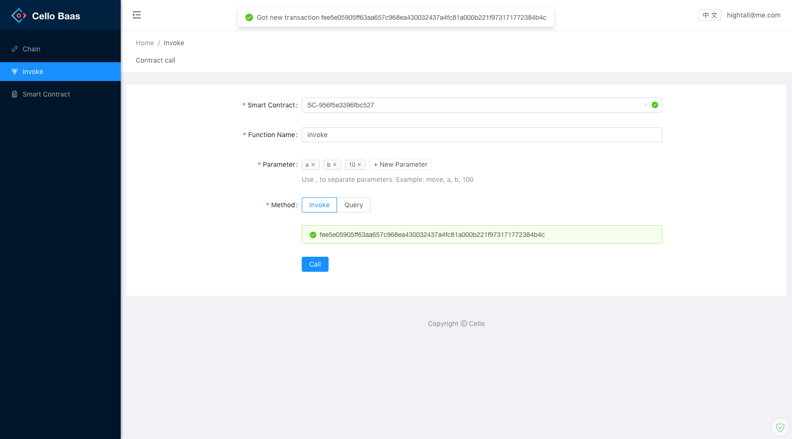

# User Dashboard

By default, the user dashboard will listen on port `8081` at the Master Node, and operators can login in with default `admin:pass` credential.

The left panel gives quick link to various functions, including `Chain`, `Invoke`, `Smart Contract`.

| Name | URL | Function |
| --- | --- | --- |
| Chain | `/dashboard#/chain` | See a high-level overview on all fabric chains |
| Invoke | `/dashboard#/api` | Invoke&Query smart contract api |
| Smart Contract | `/dashboard#/smart_contract` | Manage&Upload all smart contract |

## Chain

The default overview page show chains user applied, and the status of chain, include (peer/block/smart contract/transaction), and can query recent block/transaction info.

## Smart Contract

User can upload, install, instantiate, delete smart contract here.

## Invoke

In Invoke page, you can invoke/query smart contract api, and get the response from api.
